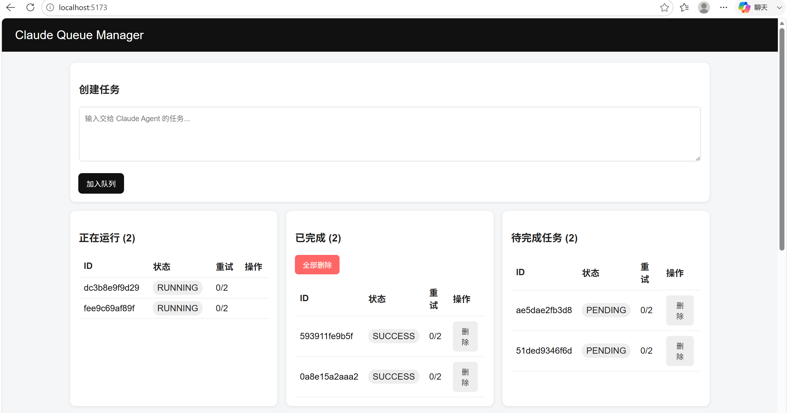
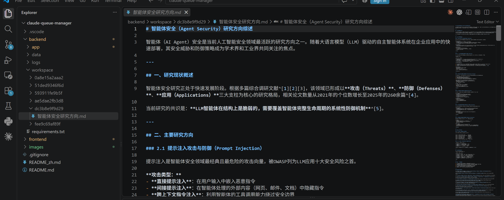
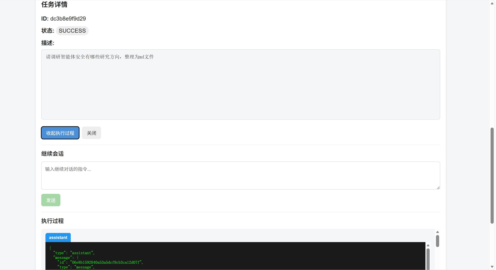

# Claude Queue Manager

本地 Claude Agent 任务队列管理平台（前后端分离架构）。

## 功能特性

- **SQLite 持久化队列** — 任务状态持久化：PENDING → RUNNING → SUCCESS/FAILED/CANCELLED
- **多 Worker 并发** — 可配置并发 worker 数量（默认：2）
- **自动领取** — Worker 完成后自动获取下一个待处理任务
- **独立 Workspace** — 每个任务在独立目录运行 (`./workspace/<task_id>/`)
- **本地 Claude CLI** — 调用 `claude -p <prompt> --dangerously-skip-permissions --output-format stream-json --verbose`
- **实时日志推送** — WebSocket 将 stdout/stderr 实时推送到前端
- **结构化Trace捕获** — 解析 JSONL 中的 tool-use 事件并以彩色卡片展示
- **自动重试** — 失败任务最多重试 `MAX_RETRIES` 次（默认：2）
- **启动恢复** — 启动时将上次标记为 RUNNING 的任务重置为 PENDING
- **会话续接** — 复用 `session_id` 在同一 Claude 会话中继续对话
- **React 前端** — 创建、查看、取消、重试、删除任务；查看日志和执行Trace

---

## 前置条件

确保本机 Claude Code CLI 可用并已完成认证：

```bash
claude --version
```

## 快速开始

### 1. 启动后端

**Windows：**
```bash
cd backend
python -m venv .venv
.venv\Scripts\activate
pip install -r requirements.txt
python -m app
```

**macOS / Linux：**
```bash
cd backend
python -m venv .venv
source .venv/bin/activate
pip install -r requirements.txt
python -m app
```

后端启动于 `http://127.0.0.1:8000`。

### 2. 启动前端

```bash
cd frontend
npm install
npm run dev
```

在浏览器中打开 **http://localhost:5173**

---

## 配置参数

| 环境变量 | 默认值 | 说明 |
|---------|--------|------|
| `HOST` | `127.0.0.1` | 后端绑定地址 |
| `PORT` | `8000` | 后端端口 |
| `CLAUDE_BIN` | `claude` | Claude CLI 路径 |
| `WORKERS` | `2` | 并发 Worker 数量 |
| `MAX_RETRIES` | `2` | 任务最大重试次数 |
| `DB_PATH` | `./data/tasks.db` | SQLite 数据库路径 |
| `WORKSPACE_ROOT` | `./workspace` | 任务工作区根目录 |
| `LOG_ROOT` | `./logs` | 日志和Trace文件目录 |

**示例（Windows）：**
```powershell
$env:WORKERS="3"
python -m app
```

---

## 效果预览

### 任务列表管理平台



### 查看运行结果



### 查看执行过程并继续同一会话



---

## 队列机制

```
┌─────────────┐     ┌─────────────┐     ┌──────────────────┐     ┌─────────────────┐
│   SQLite    │────▶│   Worker    │────▶│  Claude Session  │────▶│ SUCCESS / FAILED│
│   Queue     │     │  (asyncio)  │     │  (subprocess)    │     │    / RETRY      │
└─────────────┘     └─────────────┘     └──────────────────┘     └─────────────────┘
     ▲                   │
     │                   ↓
     │            ┌─────────────┐
     └────────────│  自动领取   │
                  │  下一任务   │
                  └─────────────┘
```

- 任务状态存储在 **SQLite** 中： `PENDING`、`RUNNING`、`SUCCESS`、`FAILED`、`CANCELLED`
- Worker 使用 `BEGIN IMMEDIATE` 原子操作领取任务，避免竞态条件
- 每个任务在 `./workspace/<task_id>/` 下拥有**独立 workspace**
- 日志写入 `./logs/<task_id>.log`，Trace 写入 `./logs/<task_id>.trace.jsonl`
- 前端通过 **WebSocket** 接收实时更新（每 3 秒轮询 `/api/tasks`）

---

## API 接口

| 方法 | 端点 | 说明 |
|------|------|------|
| `GET` | `/api/tasks` | 获取任务列表（分页） |
| `POST` | `/api/tasks` | 创建新任务 |
| `GET` | `/api/tasks/{id}` | 获取任务详情 |
| `DELETE` | `/api/tasks/{id}` | 删除任务 |
| `POST` | `/api/tasks/{id}/cancel` | 取消运行中任务 |
| `POST` | `/api/tasks/{id}/retry` | 重试失败任务 |
| `POST` | `/api/tasks/{id}/continue` | 在同一会话中继续 |
| `GET` | `/api/tasks/{id}/logs` | 流式获取原始日志 |
| `WS` | `/ws` | 实时事件流 |

---

## 安全注意

Claude Agent 可以执行命令、读取文件和修改 workspace。建议：

- 使用**专用项目目录**或 **Git worktree** 作为任务 workspace
- **避免**让不可信任务访问重要数据
- 合理设置 `workspace/` 和 `logs/` 目录的文件权限

---

## 技术栈

- **后端：** Python 3, FastAPI, Uvicorn, Pydantic, asyncio, sqlite3
- **前端：** React 18, Vite 6, 纯 CSS
- **运行时：** Node.js（前端开发服务器）
